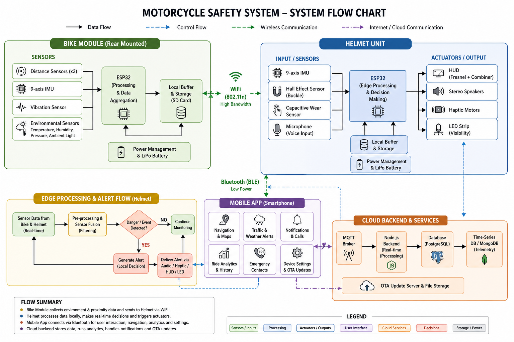

[comment]: # "This is the standard layout for the project, but you can clean this and use your own template"

# Project Title
## RoadEye

---

## Team
-  E/21/019, Adikari A.M.H.S.,(e21019@eng.pdn.ac.lk)
-  E/21/371, Senawirathne D.M.W.J.I,(e21371@eng.pdn.ac.lk)
-  E/21/416, Uthpala J.A.S,(e21416@eng.pdn.ac.lk)
-  E/21/433, Wickramanayake N.S.,(e21443@eng.pdn.ac.lk)

<!-- Image (photo/drawing of the final hardware) should be here -->

<!-- This is a sample image, to show how to add images to your page. To learn more options, please refer [this](https://projects.ce.pdn.ac.lk/docs/faq/how-to-add-an-image/) -->

<!--  -->
## Technologies Used
- ESP32
- React Native (Expo)
- Spring Boot
- PostgreSQL
- AWS

---

#### Table of Contents
1. [Introduction](#introduction)
2. [Solution Architecture](#solution-architecture )
3. [Hardware & Software Designs](#hardware-and-software-designs)
4. [Testing](#testing)
5. [Detailed budget](#detailed-budget)
6. [Conclusion](#conclusion)
7. [Links](#links)

---

## Introduction

Motorcycle riders face significantly higher risks compared to car drivers due to limited situational awareness, lack of advanced driver-assistance systems, and delayed emergency response. RoadEye is a smart motorcycle safety system designed to enhance rider awareness while minimizing distraction.

The system combines embedded sensing, real-time data processing, mobile intelligence, and cloud-based services to deliver critical information through HUD visuals, audio alerts, and haptic feedback, ensuring safer riding without cognitive overload.
---

## Problem Statement
Key challenges faced by motorcycle riders include:

- Blind spots caused by helmet design
- Poor visibility in rain, fog, and low-light conditions
- Distraction caused by mobile navigation
- Lack of real-time collision awareness
- Delayed emergency response after accidents

There is a need for a hands-free, real-time, intelligent safety system that improves awareness and ensures rapid emergency handling.

## Solution Architecture

  

---

### Description

The RoadEye system follows a distributed smart system architecture consisting of three main components:

### 1. Helmet Unit (User Interface Layer)
- Acts as the primary rider interaction interface  
- Displays alerts using a heads-up display (HUD)  
- Provides audio and haptic feedback  
- Renders real-time alerts received from the bike module  

### 2. Bike Module (Sensing & Detection Layer)
- Core data acquisition unit  
- Collects environmental and motion data  
- Performs edge-level processing  
- Sends processed alerts to the helmet  

### 3. Mobile Application (Intelligence Layer)
- Performs high-level processing and analytics  
- Stores ride history  
- Manages user preferences and emergency communication  

### Data Flow
- Sensors → Bike Module  
- Bike Module → Helmet (real-time alerts)  
- Helmet ↔ Mobile App (data synchronization & configuration)  
- Crash event → Mobile App → Emergency contacts  

---

## Hardware and Software Designs

### 🧱 Hardware Design

#### 🔹 1. Helmet Unit Hardware

**Processing Unit**
- ESP32 microcontroller  
- Handles sensor input, communication, and alert generation  

**Display System (HUD)**
- TFT micro-display  
- Fresnel lens  
- Reflective combiner  

**Purpose**
- Create a virtual distant image  
- Reduce eye strain and distraction  

**Audio System**
- Stereo speakers integrated into helmet padding  

**Haptic Feedback**
- Small vibration motors near the ears  
- Used for collision and warning alerts  

**Sensors**
- 9-Axis IMU – head motion and crash detection  
- Hall effect sensor – buckle detection  
- Capacitive sensor – helmet wear detection  

**Power System**
- Li-Po battery  
- USB-C charging module  
- Voltage regulation  

---

#### 🔹 2. Bike Module Hardware

**Processing Unit**
- ESP32 microcontroller  

**Distance Sensors**
- Ultrasonic / ToF sensors (rear and sides)  
- Used to detect approaching vehicles  

**Environmental Sensors**
- Temperature  
- Humidity  
- Pressure  
- Ambient light  

**Motion Sensors**
- 9-Axis IMU – tilt, braking, crash detection  
- Vibration sensor – road condition analysis  

**Anti-Theft Function**
- Detects movement when parked  
- Sends alert to mobile application  

#### 🔹 3. Communication
- WiFi-based communication  
- Optional Bluetooth pairing for authentication  

---

### 💻 Software Design

#### 🔹 1. Embedded Software (Helmet & Bike)
- Sensor data filtering and noise reduction  
- Threshold-based event detection  
- Priority-based alert handling  
- Power management using sleep modes  

#### 🔹 2. Mobile Application
- Dashboard displaying speed, alerts, and environment data  
- Ride analytics and statistics  
- Emergency contact management  
- Device pairing and configuration  

#### 🔹 3. Data Flow Design
- Real-time data → Helmet alerts  
- Logged data → Mobile app storage  
- Processed data → Analytics dashboard  

---

## Testing

### 🔬 Hardware Testing

#### 1. Sensor Accuracy Testing
Compared sensor outputs with real-world measurements.

| Sensor           | Result                          |
|------------------|---------------------------------|
| Distance Sensors | ±5 cm accuracy                  |
| IMU              | Stable orientation detection    |
| Light Sensor     | Correct brightness adaptation   |

#### 2. Communication Testing
WiFi latency and connection stability were evaluated.

| Test              | Result           |
|-------------------|------------------|
| Helmet ↔ Bike     | < 100 ms delay   |
| Helmet ↔ App      | Stable connection|

#### 3. Power Testing
Battery performance under normal usage:

- **Helmet Unit:** ~6–8 hours  
- **Bike Module:** ~10 hours  

#### 4. HUD Testing
Visibility and usability under different conditions:

- Daylight   
- Night  
- No significant eye strain observed  

### 💻 Software Testing

#### 1. Unit Testing
- Individual sensor modules tested  
- Alert triggering mechanisms verified  

#### 2. Integration Testing
- Helmet ↔ Bike communication validated  
- Mobile App ↔ Helmet synchronization tested  

#### 3. System Testing
Full system tested under simulated riding conditions:

- Collision alerts triggered correctly  
- Emergency alerts sent successfully  

#### 4. User Testing
Tested with real users (motorcycle riders):

| Feature| Feedback            |
|--------|---------------------|
| HUD    | Easy to use         |
| Alerts | Non-distracting     |
| Audio  | Clear               |

### Summary of Results

- Real-time alert accuracy: **High**  
- System latency: **Low**  
- Overall reliability: **Stable under most conditions**

---

## Detailed budget

All items and associated costs for the RoadEye system are summarized below.

| Item                                      | Quantity | Unit Cost (LKR) | Total (LKR) |
|-------------------------------------------|:--------:|:---------------:|------------:|
| Jumper Wire M/M 20cm                      | 3        | 190             | 570         |
| Jumper Wire F/F 20cm                      | 2        | 185             | 370         |
| Jumper Wire M/F 20cm                      | 1        | 190             | 190         |
| 1.8" TFT LCD Display                      | 1        | 1490            | 1490        |
| 2.0" TFT Color Screen                     | 1        | 2790            | 2790        |
| Digital Touch Sensor                      | 1        | 160             | 160         |
| Neodymium Magnets (5x2)                   | 5        | 60              | 300         |
| MPU-9250 9-Axis IMU                       | 1        | 1190            | 1190        |
| Hall Sensor Module                        | 1        | 260             | 260         |
| 12V 2A Power Supply                       | 1        | 790             | 790         |
| Waterproof Ultrasonic Sensor              | 1        | 1890            | 1890        |
| Ultrasonic Waterproof Sensor (5140)       | 1        | 490             | 490         |
| MAX98357 Audio Amplifier                  | 1        | 540             | 540         |
| Green Dot Board (7x9)                     | 1        | 160             | 160         |
| Female Pin Header                         | 5        | 40              | 200         |
| Vibration Motor Module                    | 1        | 250             | 250         |
| LED (5mm, Diffused)                       | 2        | 5               | 10          |
| INMP441 Microphone                        | 1        | 890             | 890         |
| Filament Roll (Black, 1kg)                | 1        | 4950            | 4950        |
| Acrylic Board                             | 1        | 600             | 600         |

---

## Conclusion

### 🎯 What Was Achieved

The RoadEye system successfully demonstrates a **complete smart motorcycle safety solution** by integrating hardware, firmware, mobile software, and cloud services into a unified platform.

**Key achievements include:**
- Fully functional smart helmet system  
- Reliable collision and crash detection  
- Automated emergency alert system  
- Minimal rider distraction through optimized human–machine interaction  

**System capabilities:**
- Real-time collision warning system  
- Reliable crash detection with emergency alert functionality  
- Minimal rider distraction through optimized human–machine interaction

---

### 🔮 Future Developments

Several enhancements can further improve the system:

- AI-based predictive risk analysis  
- Camera-based blind spot detection  
- Helmet-to-helmet communication  
- Integration with smart traffic infrastructure  
- Voice assistant for hands-free control  

---

### 💼 Commercialization Plan

**Target Users:**
- Delivery riders  
- Daily commuters  

**Product Variants:**
- **Basic Version:** Core safety alerts  
- **Advanced Version:** Full analytics + HUD features  

**Go-to-Market Strategy:**
- Partner with helmet manufacturers  
- Offer as an aftermarket add-on device

---

## 🔗 Links

- 🔹 [Project Repository](https://github.com/cepdnaclk/e21-3yp-RoadEye)  
- 🔹 [Live Project Page](https://cepdnaclk.github.io/e21-3yp-RoadEye/)  
- 🔹 [Department of Computer Engineering](http://www.ce.pdn.ac.lk/)  
- 🔹 [University of Peradeniya](https://eng.pdn.ac.lk/)   

[//]: # (Please refer this to learn more about Markdown syntax)
[//]: # (https://github.com/adam-p/markdown-here/wiki/Markdown-Cheatsheet)
